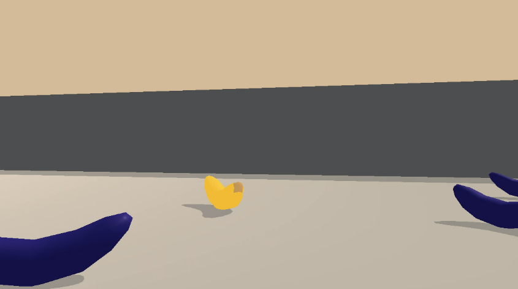
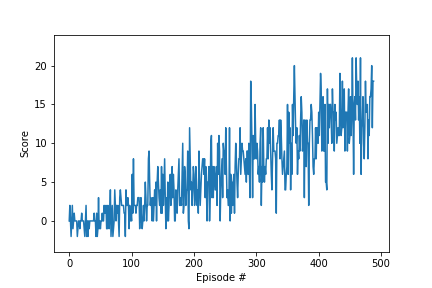

This report presents a solution to the Navigation Project in the Udacity Deep Reinforcement Learning Nanodegree. 

## Overview

In the Udacity Banana environment, a vehicle can move in any of the cardinal directions to obtain a banana. The vehicle receives a positive reward for reaching a yellow banana and a negative reward for a blue banana. An episode represents 1000 actions. To solve this environment, the user must attain an average score of +13 over 100 episodes.

  

<!-- https://gist.github.com/DavidWells/7d2e0e1bc78f4ac59a123ddf8b74932d -->

  <em> <b> Fig. 1. </b> The vehicle captures a yellow banana and avoids the blue bananas.</em>

This repository presents a solution in 489 episodes using a Deep Q-Network. The code is adapted from a Udacity-supplied solution to the OpenAI gym-Lunar Lander environment. Fig. 1 depicts the vehicle collecting a yellow banana and avoiding the blue bananas. A video can be seen [here](https://youtu.be/6kImY-3keJc). Fig. 2 shows the score increasing stochastically as the model trains.

The network trains in 4 min. 17 s. using an Intel i9-9900K 8-core CPU, 64 GB of RAM, and an 11GB NVIDIA 2080 TI GPU.

  

  <em> <b> Fig. 2. </b> The average score between episodes 390 and 489 is 13.02.</em>

## Deep Q-Network Approach

Given a state **s**, a Deep Q-Network (DQN) estimates the action **a** that maximizes the expected discounted reward. A deep neural network maps states to actions off-policy. For training, experiences are buffered, randomized, and batched together. During training, actions are chosen using an epsilon-greedy strategy, with epsilon decrementing after each episode. Google DeepMind introduced the concept of a DQN in [Nature](http://files.davidqiu.com//research/nature14236.pdf) in 2015. 

### Network Architecture and Hyperparameters
The input to the architecture is a 37-element state vector. This [state space](https://github.com/Unity-Technologies/ml-agents/issues/1134) includes both the forward and lateral velocities and the relative angular position of both types of bananas. The architecture of the network consists of a 37 x 64 fully-connected layer, a relu activation function, a 64 x 64 fully connected layer, a second relu activation function, and a 64 x 4 fully connected layer. The output is a four-element action vector that  represents the cardinal directions. For a trained network, the output with the highest value is the action associated with the input state.

Key hyperparameters that represent the network include batch size (64), learning rate (1e-3), discount factor (0.99), buffer size (1e5), and tau (1e-3). During each episode of training, the vehicle steps through the environment. After every fourth step, provided that the buffer contains enough experiences, the weights of the regular network are learned. The previous weights of the target network add to the updated weights of the regular network by the ratio of tau:(1 - tau) to form the new weights of the target network.

### Hyper-parameter Tuning

The hyperparameters were tuned individually to solve the environment in fewer episodes. The initial learning rate was 5e-4, and the initial values of the other parameters are the same as their current values. The following observations suggest that the two most sensitive hyperparameters are the learning rate and tau.

Increasing the batch size from 64 to 128 to 256 substantially increased the training time (from 282 s. to 305 s. to 356 s), but only marginally affected the number of episodes needed to reach a solution (515, 531, and 513 episodes respectively).

The batch size was reset to 64, and the learning rate was increased to 5e-3. This rate was too high for learning, and it was then reduced to 1e-3. 

Setting the discount factor (gamma) to 1 and later 0.95 marginally increased the number of episodes needed to train (511 and 513 respectively), and the value was returned to 0.99. 
 	
Changing the value of tau dramatically reduced performance. Increasing tau to 1e-2 produced a solution in 819 episodes, whereas decreasing tau to 1e-4 yielded an average score of less than 5 after 500 episodes.

Varying the buffer size to 1e6 and later 1e4 resulted in a solution in 556 and 551 episodes respectively.

In addition, the number of weights in the network did not significantly affect training. Modifying the size of the second fully-connected layer to 32 x 32 and later 128 x 128 (with the adjacent fc layers adjusted accordingly) resulted in only a modest increase in the number of episodes needed to train the network (492 and 512 respectively).

## Future Work

To be sure, the agent's performance may be improved with a finer grid search about the learning rate and tau.
	
One area of future exploration includes training with pixels as input and assessing the general transferability of hyper-parameters. In the [DeepMind paper](http://files.davidqiu.com//research/nature14236.pdf), the same set of hyper-parameters and a similar network architecture were used across a varigated set of Atari environments with pixelated input. 

Here, the same set of hyper-parameters and a similar network architecture successfully solved both the unpixelated Lunar-Lander and unpixelated Banana environments. Thus, the same hyper-parameters and network architecture used in the DeepMind approach may solve the pixelated Banana environment.

## References

V. Mnih et. al., “[Human-level control through deep reinforcement learning](http://files.davidqiu.com//research/nature14236.pdf),” Nature, vol. 518, no. 7540, pp. 529–533, Feb. 2015. 

